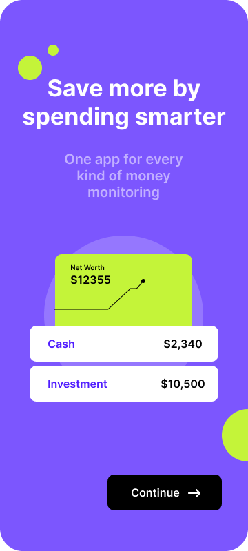
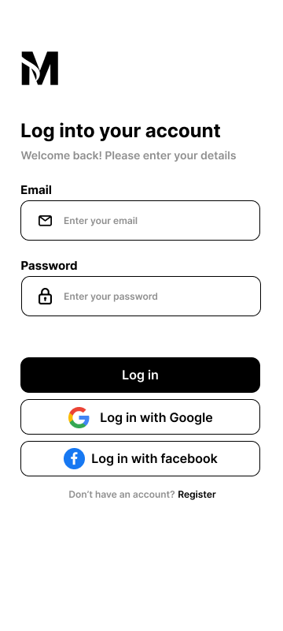
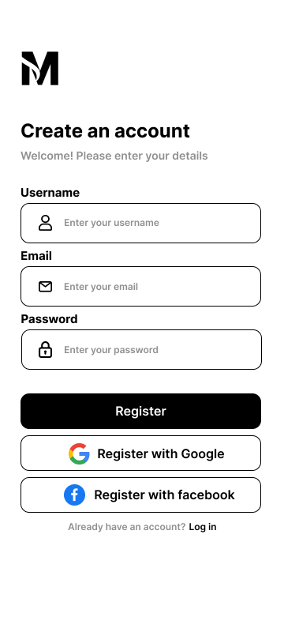

# Expense Tracker App

An intuitive expense tracker app built with <span style="color: blue;">**Flutter**</span> and <span style="color: yellow;">**Firebase**</span>, allowing users to manage their expenses seamlessly.

## Table of Contents

- [Features](#features)
- [Design Screenshots](#design-screenshots)
- [Getting Started](#getting-started)
  - [Prerequisites](#prerequisites)
  - [Installation](#installation)
- [Usage](#usage)
- [Firebase Configuration](#firebase-configuration)
- [Contributing](#contributing)
- [Contact the Developer](#contact-the-developer)

## Features

- **User Authentication**: Secure sign-up and login functionality.
- **Expense Tracking**: Log and categorize your expenses effortlessly.
- **Real-time Data Sync**: Firebase integration for real-time data updates.
- **Data Visualization**: Interactive charts to visualize your spending patterns.
- **Expense Categories**: Categorize expenses for better organization.
- **Budgeting**: Set and monitor monthly budgets.

## Design Screenshots

- You can take inspiration from the design: [View Design](https://www.figma.com/file/byfiqRpB0VYXMYUCifoacx/Moneyty-Design-v1.0?type=design&node-id=0%3A1&mode=design&t=LyTA7LUFpc3aAfXm-1)

<!-- 
*Onboarding Screen* -->

<p float='left'>




</p>

**More designs are coming**

## Getting Started

This project is a starting point for a Flutter application.

A few resources to get you started if this is your first Flutter project:

- [Lab: Write your first Flutter app](https://docs.flutter.dev/get-started/codelab)
- [Cookbook: Useful Flutter samples](https://docs.flutter.dev/cookbook)

For help getting started with Flutter development, view the
[online documentation](https://docs.flutter.dev/), which offers tutorials,
samples, guidance on mobile development, and a full API reference.

### Prerequisites

- [Flutter](https://flutter.dev/docs/get-started/install) installed on your machine.
- [Firebase](https://firebase.google.com/docs/flutter/setup) project set up.

### Installation

1. Clone the repository:

   ```bash
   git clone https://github.com/your-username/expense-tracker-app.git
   ```

## Usage

**Note:** The app will be available on the Play Store once we have completed the development and testing phase. In the meantime, you can use the current version of the app by following these steps:

1. **Star the Repo**: Click the "Star" button at the top of the repository to show your support.

2. **Fork the Repo**: Fork the repository to create your own copy.

3. **Clone the Repo**: Clone the repository to your local machine using the following command:

   ```bash
   git clone https://github.com/your-username/expense-tracker-app.git
   ```

4. **Essential Commands**: run this following commands in your local system (make sure you are in the root directory of the project while running the commands):

   ```bash
   flutter pub get
   ```

5. **Run the app**: run the app in your local system

## Firebase Configuration

**Note:** There is no need to configure anything for firebase. Every has been taken care of.

## Contributing

**Note:** If you want to contribute to the project please make sure you first use and test the app by following the steps mentioned in [Usage](#usage). Then follow the below steps:

1. **Create new issue**: Create a new issue for the project. Tag me and get yourself attached to the issue.

2. **Fix the Issue**: Fix the changes in your local system. Make the needed changes in the code (Don't mess the code. Maintain the architecture and quality of the project).

    a. **Clone the Repository**: Clone the repository to your local machine. Replace `<your-username>` with your actual GitHub username.

    ```bash
    git clone https://github.com/<your-username>/expense-tracker-app.git
    ```

    b. **Create a Branch**: Create a new branch for your contribution. Use a descriptive branch name that reflects the nature of your changes.

    ```bash
    git checkout -b <your-name>/feature/fix-issue-<issue-number>
    ```

    c. **Make Changes**: Implement the changes or additions needed to fix the issue. Ensure that your code follows the project's coding standards and guidelines.

    d. **Commit Changes**: Commit your changes with a clear and concise commit message.

    ```bash
    git add .
    git commit -m "Fix issue #<issue-number>: Describe the fix"
    ```

3. **Push the changes**: Push the changes first to your forked repo.

    ```bash
    git push origin <your-name>/feature/fix-issue-<issue-number>
    ```

4. **Raise PR**: Raise a pull request to my repo to merge the commits made by you. (Write the description of the PR properly. Make sure to mention the issue number in the description of the pr.)

**Thank you for contributing to our project! 🚀**

## Contact the Developer

If you have any questions, suggestions, or just want to say hello, feel free to contact the developer:

- **Developer Name**: Subrata Rajak
- **Email**: <subratarajak956@gmail.com>
- **LinkedIn**: [Subrata Rajak](https://www.linkedin.com/in/subrata-connect/)

Feel free to open an issue on the repository for bug reports, feature requests, or general feedback. Pull requests are also welcome!

Thank you for your interest and support in this project! 🚀
